<p align="center">
  
</p>

<p align="center">
  
  
  
  
  
</p>

<p align="center">
  <strong>Build, execute, observe, and evaluate AI agents with confidence.</strong>
  <br>
  <em>Durable execution • Real-time observability • Evals-as-code</em>
</p>

---

## What is Neon?

Neon is an **Agent Ops platform** that handles the entire lifecycle of AI agents: **Build → Execute → Observe → Evaluate → Optimize**.

| Challenge | Neon's Solution |
|-----------|-----------------|
| Agents fail unpredictably (timeouts, rate limits, crashes) | **Durable execution** with Temporal - workflows survive any failure |
| No visibility into agent reasoning and tool usage | **Real-time observability** with ClickHouse - sub-second trace queries |
| Evaluations are fragile scripts that break | **Evals-as-code SDK** - version-controlled, CI/CD integrated |
| Can't compare agent versions systematically | **Regression detection** - A/B comparison with statistical analysis |

## Two Integration Modes

### Mode 1: Observe-Only (Bring Your Own Agent)

Your agents run anywhere (Cloud Run, Lambda, K8s). Just send traces via OpenTelemetry.

```python
# Your existing agent - just add OTel
from opentelemetry import trace
tracer = trace.get_tracer("my-agent")

@tracer.start_as_current_span("agent-run")
async def run_agent(query: str):
    # Your agent code unchanged
    response = await llm.generate(query)
    return response
```

### Mode 2: Managed Execution (Temporal)

Run agents inside Neon for durable execution, human-in-the-loop approval, and automatic retry.

```typescript
// Temporal workflow - survives any failure
export async function agentRunWorkflow(params: AgentRunInput) {
  const result = await llmCall({ model: 'claude-3-5-sonnet', messages });

  if (params.requireApproval) {
    await condition(() => approvalReceived, '7 days'); // Wait for human
  }

  return result;
}
```

## Features

- **Durable Agent Execution** — Temporal workflows that survive crashes, timeouts, and rate limits
- **Real-time Observability** — ClickHouse-powered trace storage with sub-100ms queries
- **Evals-as-Code SDKs** — Define tests, scorers, and datasets in TypeScript or Python
- **OTel Compatible** — Accept traces from any OpenTelemetry-instrumented agent
- **Human-in-the-Loop** — Pause workflows for approval, then resume
- **Regression Detection** — Compare agent versions and catch quality drops
- **CI/CD Integration** — GitHub Action that gates deploys on eval results

## Quick Start

### 1. Start Infrastructure

```bash
# Clone the repo
git clone https://github.com/Sean-Koval/neon.git
cd neon

# Start ClickHouse + Postgres
docker compose up -d

# Start the frontend
cd frontend && bun install && bun dev
```

### 2. Send Your First Trace

```bash
# Insert a test trace
curl -X POST http://localhost:3000/api/traces/ingest \
  -H "Content-Type: application/json" \
  -H "x-project-id: my-project" \
  -d '{
    "trace_id": "test-001",
    "name": "agent-run",
    "status": "ok",
    "duration_ms": 1500
  }'

# View in dashboard
open http://localhost:3000/traces
```

### 3. Define Evals-as-Code

<table>
<tr>
<td><strong>TypeScript</strong></td>
<td><strong>Python</strong></td>
</tr>
<tr>
<td>

```typescript
// evals/my-agent.eval.ts
import {
  trace, generation, tool,
  contains, llmJudge
} from '@neon/sdk'

// Tracing
const result = await trace('agent-run', async () => {
  return await generation('llm-call', {
    model: 'claude-3-5-sonnet'
  }, async () => {
    return await llm.chat(prompt)
  })
})

// Scoring
const scorer = contains(['temperature', 'weather'])
const score = scorer.evaluate(context)
```

</td>
<td>

```python
# evals/my_agent.py
from neon_sdk import trace, generation, tool
from neon_sdk.scorers import contains, llm_judge

# Tracing
with trace("agent-run"):
    with generation("llm-call", model="claude-3-5-sonnet"):
        result = await llm.chat(prompt)

# Scoring
scorer = contains(["temperature", "weather"])
score = scorer.evaluate(context)
```

</td>
</tr>
</table>

#### Install SDKs

```bash
# TypeScript
bun add @neon/sdk

# Python
pip install neon-sdk
# Or with optional integrations
pip install neon-sdk[temporal,clickhouse]
```

## Architecture

### Platform Overview

```mermaid
flowchart TB
    subgraph Define["📝 DEFINE"]
        Agents[Agents]
        Tests[Tests]
        Scorers[Scorers]
        Datasets[Datasets]
    end

    subgraph Execute["⚡ EXECUTE"]
        Temporal[Temporal Workflows]
        Workers[Durable Workers]
        HITL[Human-in-the-Loop]
    end

    subgraph Observe["👁️ OBSERVE"]
        CH[(ClickHouse)]
        Traces[Real-time Traces]
        Dashboard[Dashboard]
    end

    subgraph Evaluate["📊 EVALUATE"]
        SDK[SDK Scorers]
        LLMJudge[LLM Judge]
        RuleBased[Rule-based]
    end

    subgraph Optimize["🎯 OPTIMIZE"]
        AB[A/B Testing]
        Regression[Regression Detection]
        Insights[Insights]
    end

    Define --> Execute
    Execute --> Observe
    Observe --> Evaluate
    Evaluate --> Optimize
    Optimize -.-> Define
```



### Data Flow


### Evaluation Workflow


### Component Architecture


## Project Structure

```
neon/
├── frontend/                 # Next.js 15 app (UI + API routes)
│   ├── app/
│   │   ├── api/              # tRPC API endpoints
│   │   │   ├── traces/       # Trace ingestion & queries
│   │   │   └── scores/       # Score management
│   │   ├── traces/           # Trace viewer UI
│   │   ├── workflows/        # Workflow management UI
│   │   └── compare/          # A/B comparison UI
│   ├── components/           # React components
│   ├── hooks/                # React hooks
│   └── lib/
│       ├── clickhouse.ts     # ClickHouse client
│       └── temporal.ts       # Temporal client
│
├── temporal-workers/         # Temporal workflow workers
│   └── src/
│       ├── workflows/        # Eval & agent workflows
│       └── activities/       # LLM calls, tool execution
│
├── packages/
│   ├── sdk/                  # @neon/sdk - TypeScript SDK
│   │   ├── tracing/          # Trace context & spans
│   │   └── scorers/          # Rule-based, LLM judge, causal
│   │
│   ├── neon-sdk-python/      # neon-sdk - Python SDK
│   │   ├── tracing/          # Context managers & decorators
│   │   ├── scorers/          # Rule-based, LLM judge, causal
│   │   ├── clickhouse/       # ClickHouse client (optional)
│   │   └── temporal/         # Temporal client (optional)
│   │
│   ├── shared/               # @neon/shared - Shared types
│   └── temporal-client/      # @neon/temporal-client
│
├── scripts/
│   ├── clickhouse-init.sql   # Database schema
│   └── integration-test.ts   # E2E tests
│
└── docker-compose.yml        # Infrastructure
```

## Tech Stack

| Layer | Technology | Purpose |
|-------|------------|---------|
| **Frontend** | Next.js 15, React 19 | Dashboard & API routes |
| **Trace Storage** | ClickHouse | Sub-ms queries on millions of traces |
| **Orchestration** | Temporal | Durable workflow execution |
| **Metadata** | PostgreSQL | Projects, configs, users |
| **Streaming** | Redpanda (opt-in) | High-throughput trace ingestion |
| **SDKs** | TypeScript, Python | Evals-as-code with full type safety |
| **Package Managers** | Bun, uv | Fast dependency management |

## Development

### Prerequisites

- Node.js 20+ / Bun 1.0+
- Docker & Docker Compose

### Local Setup

```bash
# Install dependencies
cd frontend && bun install

# Start infrastructure
docker compose up -d

# Run dev server
bun dev

# Run tests
bun test

# Type check
bun run typecheck
```

### Docker Compose Profiles

```bash
# Core only (ClickHouse + Postgres)
docker compose up -d

# With Temporal (for managed execution)
docker compose --profile temporal up -d

# With streaming (high-throughput ingestion)
docker compose --profile streaming up -d

# Everything
docker compose --profile full up -d
```

## API Reference

### Traces

```bash
# List traces
GET /api/traces?project_id=xxx&limit=50

# Get trace with spans
GET /api/traces/{trace_id}

# Ingest trace (OTel compatible)
POST /api/traces/ingest
```

### Scores

```bash
# List scores for trace
GET /api/scores?trace_id=xxx

# Create score
POST /api/scores
{
  "trace_id": "xxx",
  "name": "accuracy",
  "value": 0.95,
  "source": "eval"
}
```

## Comparison with Alternatives

| Capability | Langfuse | Braintrust | **Neon** |
|------------|----------|------------|----------|
| Trace Collection | ✅ | ✅ | ✅ |
| OTel Ingestion | ✅ | ❌ | ✅ |
| Evaluation | ✅ | ✅ | ✅ |
| **Durable Eval Orchestration** | ❌ | ❌ | ✅ Temporal |
| **Managed Agent Execution** | ❌ | ❌ | ✅ Temporal |
| **Human-in-the-Loop** | ❌ | ❌ | ✅ |
| **Time-Travel Debugging** | ❌ | ❌ | ✅ |
| Self-Hosted | ✅ | ❌ | ✅ |
| Real-time Streaming | ❌ | ❌ | ✅ Redpanda |

## Roadmap

### Completed
- [x] ClickHouse trace storage
- [x] Next.js API routes with tRPC
- [x] Trace viewer UI
- [x] Docker Compose infrastructure
- [x] @neon/sdk TypeScript package (tracing, scorers, client)
- [x] neon-sdk Python package (tracing, scorers, ClickHouse, Temporal)
- [x] Temporal workflow definitions
- [x] Multi-component correlation analysis

### In Progress
- [ ] Temporal eval workflow execution
- [ ] Dataset management UI
- [ ] A/B comparison UI
- [ ] Score regression alerts

### Planned
- [ ] GitHub Action for CI/CD
- [ ] Export to DSPy format
- [ ] Workspace/organization model
- [ ] Audit logs for compliance

## Contributing

Contributions are welcome! Please see [CONTRIBUTING.md](./CONTRIBUTING.md) for guidelines.

## License

MIT

---

<p align="center">
  <sub>Built with ⚡ for the future of AI agents</sub>
</p>
